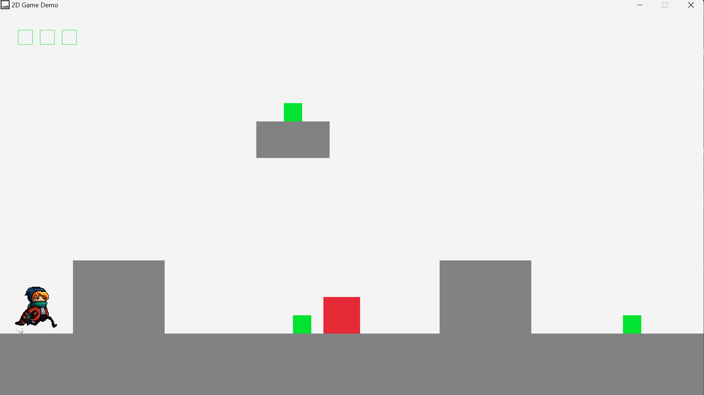

# 2D Game Demo

This is a small demo of a 2D platform game built in C using the [Raylib](https://www.raylib.com/index.html) graphics library.

## Features
- Player movement: Player can move left, right, and jump with gravity affecting movement.
- Collision detection: Axis-Aligned Bounding Box (AABB) is used for detecting collision between player and objects. Interleaving single-axis method is used for updating player position and velocity.
- Objects: environment tiles, enemy, collectables (apple).

## Getting Started
### Prereqresites
This project is intended for VSCode on Windows PC. Raylib must be present under C: disk to build the project. You can download raylib through [this link](https://www.raylib.com/index.html)`

If you have raylib installed else where, you can copy it to C: disk for building the project, otherwise compiling json files and Makefile need to be changed accordingly.

### Installation
1. Clone the repository:
```shell
git clone https://github.com/theVeryPulse/2D_game_demo.git
cd 2D_game_demo
```
2. Open the folder in VSCode.

3. Press `F5`, the project will be automatically compiled and run.

## Controls
Conventional controls: Arrows, spacebar, and WSAD.

## Playthrough


## Future Improvements
- Optimize checking whether player is still supported by an object when moving left and right.
- Optimize collision checking algorithm for objects and collectables - currently it is brute force.

## Useful Links
- [Unlocking VSCode's power to make GAMES in C | Video](https://www.youtube.com/watch?v=xWWqhQ1JnvE&t=72s)
- [Raylib Template for Multiple C Files | Github](https://github.com/AndrewHamel111/raylib-VSCode-Template)